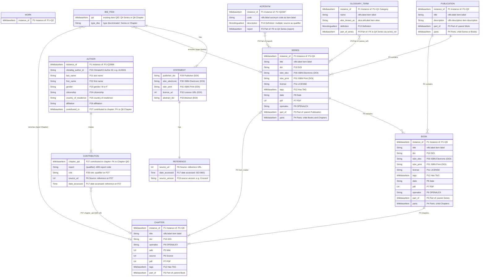

```mermaid
erDiagram

    %% -- corpus-ar6.dtd ------------------------------------------
    %% Top-level corpus structure (Work, Publication, Series, Book, Chapter)
    %%  WORK=Q2  PUBLICATION=Q3  SERIES=Q4  BOOK=Q5  CHAPTER=Q6

    WORK {
        WikibaseItem instance_of "P1 Instance of: P1=Q2"
    }
    PUBLICATION {
        WikibaseItem instance_of "P1 Instance of: P1=Q3"
        String title "rdfs:label item label"
        String description "rdfs:description item description"
        WikibaseItem part_of "P3 Part of: parent Work"
        WikibaseItem parts "P4 Parts: child Series or Books"
    }
    SERIES {
        WikibaseItem instance_of "P1 Instance of: P1=Q4"
        String title "rdfs:label item label"
        String doi "P10 DOI"
        String isbn_elec "P30 ISBN Electronic (DOI)"
        String isbn_print "P31 ISBN Print (DOI)"
        String license "P11 LICENSE"
        WikibaseItem tags "P12 Has TAG"
        String date "P8 Date"
        Url pdf "P7 PDF"
        String openalex "P9 OPENALEX"
        WikibaseItem part_of "P3 Part of: parent Publication"
        WikibaseItem parts "P4 Parts: child Books and Chapters"
    }
    BOOK {
        WikibaseItem instance_of "P1 Instance of: P1=Q5"
        String title "rdfs:label item label"
        String doi "P10 DOI"
        String isbn_elec "P30 ISBN Electronic (DOI)"
        String isbn_print "P31 ISBN Print (DOI)"
        String license "P11 LICENSE"
        WikibaseItem tags "P12 Has TAG"
        String date "P8 Date"
        Url pdf "P7 PDF"
        String openalex "P9 OPENALEX"
        WikibaseItem part_of "P3 Part of: parent Series"
        WikibaseItem parts "P4 Parts: child Chapters"
    }
    CHAPTER {
        WikibaseItem instance_of "P1 Instance of: P1=Q6"
        String title "rdfs:label item label"
        String doi "P10 DOI"
        String openalex "P9 OPENALEX"
        Url wiki "P5 Wiki"
        Url source "P6 Source"
        Url pdf "P7 PDF"
        WikibaseItem tags "P12 Has TAG"
        WikibaseItem part_of "P3 Part of: parent Book"
    }
    PUBLICATION ||--o{ SERIES : "P4 contains"
    PUBLICATION ||--o{ BOOK : "P4 contains"
    SERIES ||--o{ BOOK : "P4 contains"
    SERIES |o--|{ CHAPTER : "P4 front_matter"
    BOOK ||--|{ CHAPTER : "P4 chapters"

    %% -- authors-ar6.dtd ------------------------------------------
    %% IPCC AR6 author records linked to Chapter items via P27
    %%  AUTHOR=Q3998

    AUTHOR {
        WikibaseItem instance_of "P1 Instance of: P1=Q3998"
        String climatkg_author_id "P20 ClimateKG Author ID: e.g. AU0001"
        String last_name "P21 last name"
        String first_name "P22 first name"
        String gender "P23 gender: M or F"
        String citizenship "P24 citizenship"
        String country_of_residence "P25 country of residence"
        String affiliation "P26 affiliation"
        WikibaseItem contributed_to "P27 contributed to chapter: FK to Q6 Chapter"
    }
    CONTRIBUTION {
        WikibaseItem chapter_qid "P27 contributed to chapter: FK to Chapter QID"
        String report "(qualifier): AR6 report code"
        String role "P28 role: qualifier on P27"
        Url source_url "P6 Source: reference on P27"
        Time date_accessed "P17 date accessed: reference on P27"
    }
    AUTHOR ||--|{ CONTRIBUTION : "makes"
    CONTRIBUTION }o--o| CHAPTER : "P27 chapter_qid (QID ref)"

    %% -- bibliographic-ar6.dtd ------------------------------------------
    %% DOI bibliographic enrichment added to existing Series and Chapter items
    %%  BIB_ITEM=Q4 or Q6

    BIB_ITEM {
        WikibaseItem qid "existing item QID: Q4 Series or Q6 Chapter"
        String type_disc "type discriminator: Series or Chapter"
    }
    STATEMENT {
        String publisher_doi "P29 Publisher (DOI)"
        String isbn_electronic "P30 ISBN Electronic (DOI)"
        String isbn_print "P31 ISBN Print (DOI)"
        Url licence_url "P32 Licence URL (DOI)"
        String abstract_doi "P33 Abstract (DOI)"
    }
    REFERENCE {
        Url source_url "P6 Source: reference URL"
        Time date_accessed "P17 date accessed: ISO 8601"
        String source_version "P19 source version: e.g. Crossref"
    }
    BIB_ITEM ||--|{ STATEMENT : "has"
    STATEMENT ||--|| REFERENCE : "has"
    BIB_ITEM }o--o| SERIES : "enriches (type=Series)"
    BIB_ITEM }o--o| CHAPTER : "enriches (type=Chapter)"

    %% -- glossary-ar6.dtd ------------------------------------------
    %% IPCC AR6 glossary terms (P1=Q1 Category) linked to Series via P3
    %%  GLOSSARY_TERM=Q1

    GLOSSARY_TERM {
        WikibaseItem instance_of "P1 Instance of: P1=Q1 Category"
        String name "rdfs:label item label"
        String also_known_as "skos:altLabel item alias"
        Monolingualtext definition "P13 Definition"
        WikibaseItem part_of_series "P3 Part of: FK to Q4 Series via series_ref"
    }
    GLOSSARY_TERM }o--o{ SERIES : "P3 Part of (series_ref)"

    %% -- acronyms-ar6.dtd ------------------------------------------
    %% IPCC AR6 acronyms (P1=Q2087 Acronym) linked to Series reports via P3
    %%  ACRONYM=Q2087

    ACRONYM {
        WikibaseItem instance_of "P1 Instance of: P1=Q2087"
        String code "rdfs:label acronym code as item label"
        Monolingualtext description "P13 Definition: multiple; source as qualifier"
        WikibaseItem report "P3 Part of: FK to Q4 Series (report)"
    }
    ACRONYM }o--o{ SERIES : "P3 Part of (report)"

```